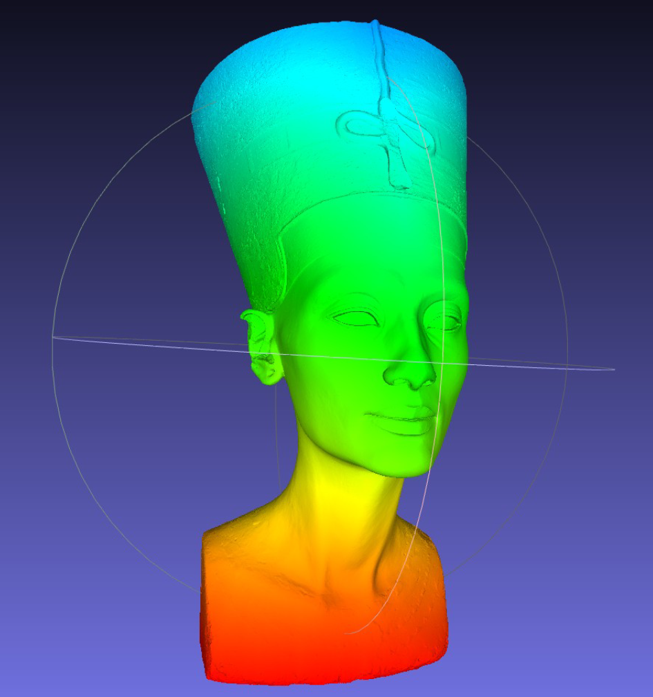
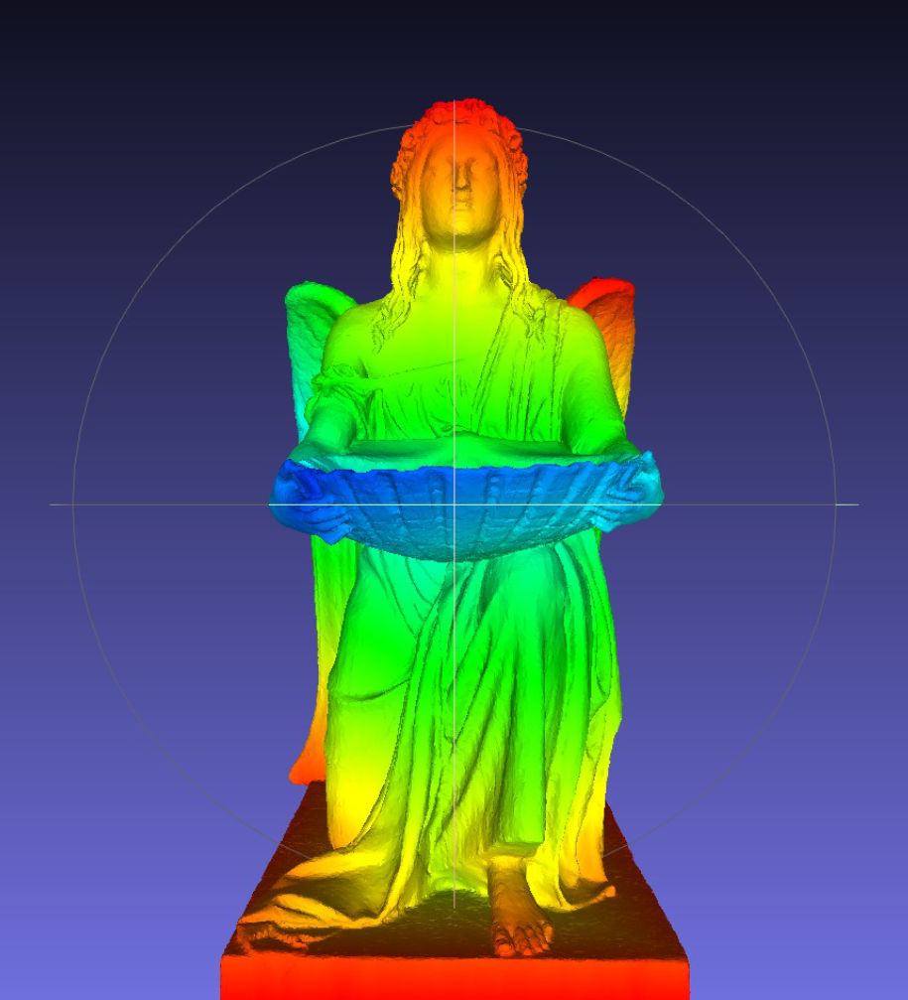
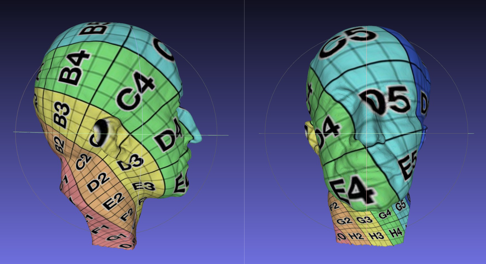

# Mathematical and Physical Foundations for Computer Graphics

Coursework for the **Mathematical and Physical Foundations for Computer Graphics** course, part of the Master's Degree in Computer Graphics, Games, and Virtual Reality at **Universidad Rey Juan Carlos (URJC)**.

## P1 — Data Structures and Algorithms for Triangle Meshes

This project explores algorithms for processing triangular meshes: mesh statistics, degenerated triangle checker, distance computation, mesh topology and automatic UV parameterization.

### Vertex Distance to the Nearest Boundary

Computes the distance from each vertex to the nearest mesh boundary. The results are visualized on 3D models using color mapping.

- **Performance:** Processed a mesh with 990K vertices (Nefertiti) in 1.77 seconds.
- **Topology:** Supports manifold meshes with multiple boundary loops (Angel), including meshes with holes.

| Nefertiti | Angel |
|:---:|:---:|
|  |  |

### Automatic UV Mapping

Implements automatic UV parameterization for triangular meshes with **Euler characteristic \(&chi; = 1\)**, corresponding to a topological disk under the usual connected, orientable manifold assumptions.

The method uses **barycentric mapping** (from *Polygon Mesh Processing 2010*) to compute 2D texture coordinates for mesh vertices, mapping the surface to a planar domain suitable for texture mapping.

| Plank, 45k vertices in 0.286 seconds |
|:---:|
|  |
